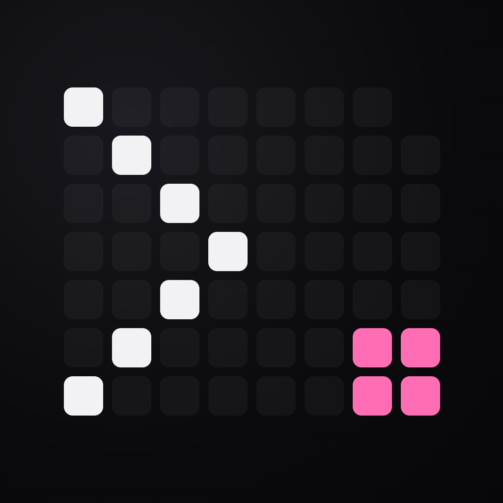
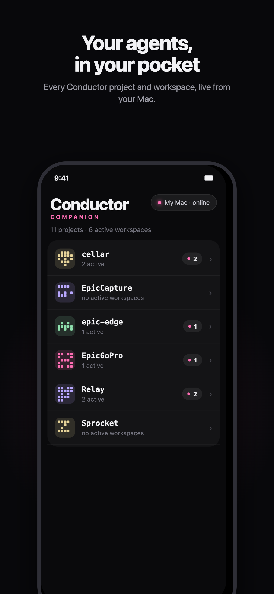
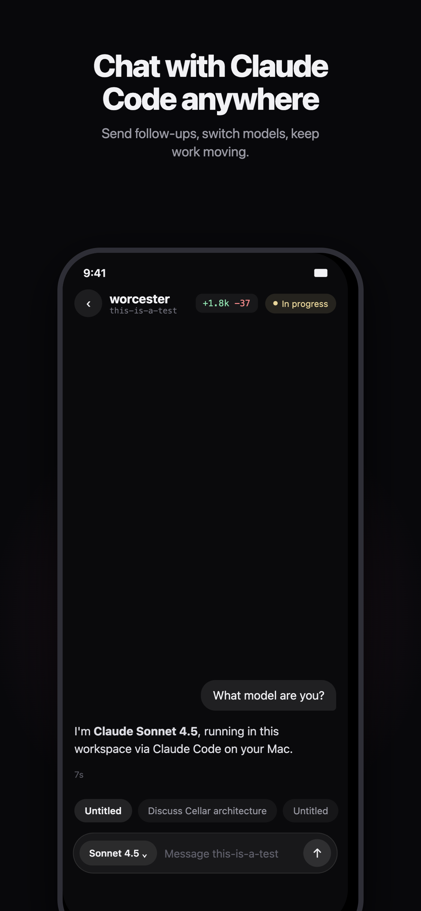
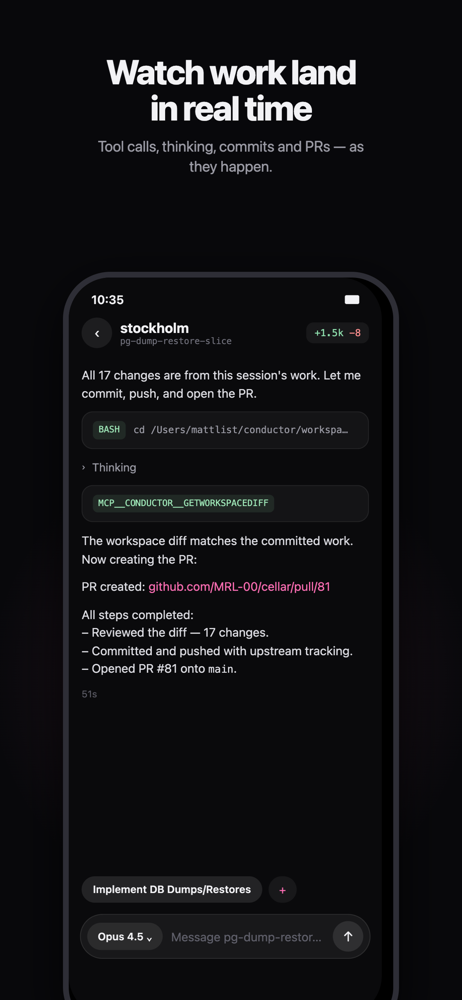
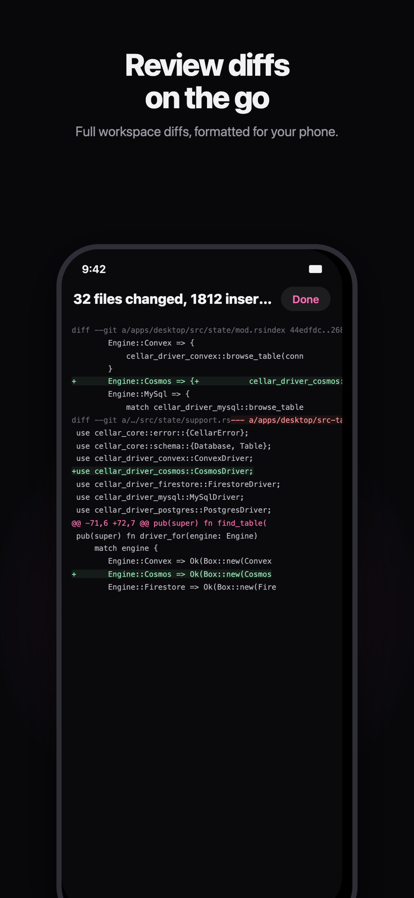
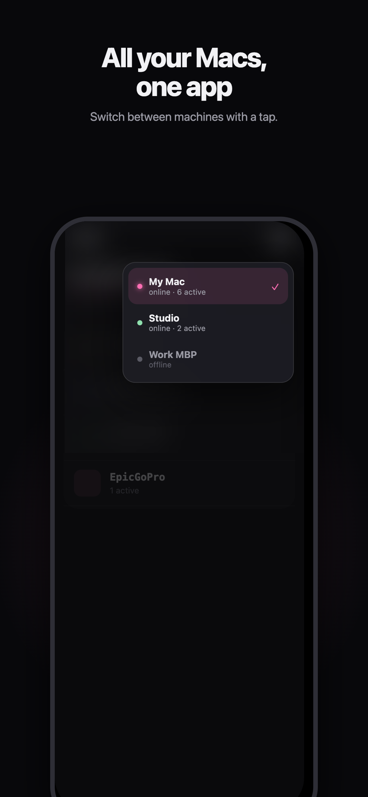

<p align="center">
  
</p>

# Conductor Mobile

An unofficial iOS companion app for [Conductor](https://www.conductor.build/) — browse your projects, workspaces, and chat history from your phone, and keep talking to your agents while away from your Mac.

Conductor doesn't have a mobile app, so this one works by pairing a small companion server on your Mac (which reads Conductor's local SQLite database and drives the agent CLIs directly) with a native SwiftUI app on the phone.

<p align="center"><em>Start a task on your laptop → go for a walk → keep directing the agent from your phone → come back and continue on the desktop.</em></p>

## Screenshots

<p align="center">
  <a href="docs/images/projects.png"></a>
  <a href="docs/images/chat.png"></a>
  <a href="docs/images/realtime.png"></a>
</p>

<p align="center">
  <a href="docs/images/diffs.png"></a>
  <a href="docs/images/macs.png"></a>
</p>

## Features

- **Projects & workspaces** — all your Conductor repos and worktrees, with live status badges, branches, and unread indicators
- **Full chat history** — messages, thinking blocks, tool calls, durations, inline images
- **Send messages** — continue any session from your phone; replies stream in with a live activity line and stop button
- **All harnesses** — Claude Code, Codex, Cursor (Grok/Composer), and OpenCode sessions are all supported
- **Desktop sync** — turns sent from the phone are written into Conductor's database in its native format, so they appear in the desktop app (after a Conductor restart) and the conversation never forks
- **Model picker** — override the model per-send on Claude Code sessions (including 1M-context variants)

## How it works

```
iPhone app (SwiftUI)
      │  HTTP + bearer token (use Tailscale to reach your Mac from anywhere)
      ▼
Companion server on the Mac (Bun, single file)
      ├─ READ:  Conductor's SQLite db → repos, workspaces, sessions, messages
      ├─ WRITE: phone-sent turns → same db, Conductor's native envelope format
      └─ RUN:   claude / codex / cursor-agent / opencode CLIs, resuming the
                session in the workspace's worktree
```

## Setup

### Mac (companion server)

Requires [Bun](https://bun.sh) and Conductor.

```sh
curl -fsSL https://raw.githubusercontent.com/MRL-00/conductor-mobile/main/server/install.sh | bash
```

(Or from a checkout: `./server/install.sh`.)

This installs a login LaunchAgent that keeps the server running (and the Mac awake via `caffeinate -s`), auto-restarts it, and prints the auth token for the phone app. Token persists in `~/.conductor-companion/token`; logs in `~/.conductor-companion/server.log`. Uninstall with `./server/install.sh --uninstall`. (Or just run it manually: `cd server && bun run server.ts`.)

### iPhone

Open `ConductorMobile.xcodeproj` in Xcode (26+), build to your device (iOS 26+). In the app's Settings, enter:

- Or scan the QR code the server prints with the iPhone camera — it fills in the address and token automatically. Manual entry still works:
- **Server address** — `http://<your-mac>:8940` (a [Tailscale](https://tailscale.com) hostname makes this work from anywhere)
- **Auth token** — the token the server printed

## Caveats

- Conductor's database schema is **undocumented and unofficial** — a Conductor update may change it and break things (loudly, not silently). Back up `~/Library/Application Support/com.conductor.app/conductor.db` if you're cautious.
- The desktop app shows phone-sent turns after a restart (it reads the db on launch).
- Claude Code sessions run with `--permission-mode acceptEdits`; riskier actions are auto-denied rather than prompted. Cursor sessions run with `--trust`.
- Non-Claude harness adapters are built against current CLI output formats (codex 0.144, cursor-agent, opencode) and may need tweaks as those CLIs evolve.

## Security

The server exposes your chat history and can run agents in your repos. It requires a bearer token on every request, serves attachments only from within workspace directories, and should only be reachable over a private network (LAN or Tailscale). Don't port-forward it to the open internet.

## Status

Personal project, built for our own workflow. PRs and issues welcome, but no promises.
